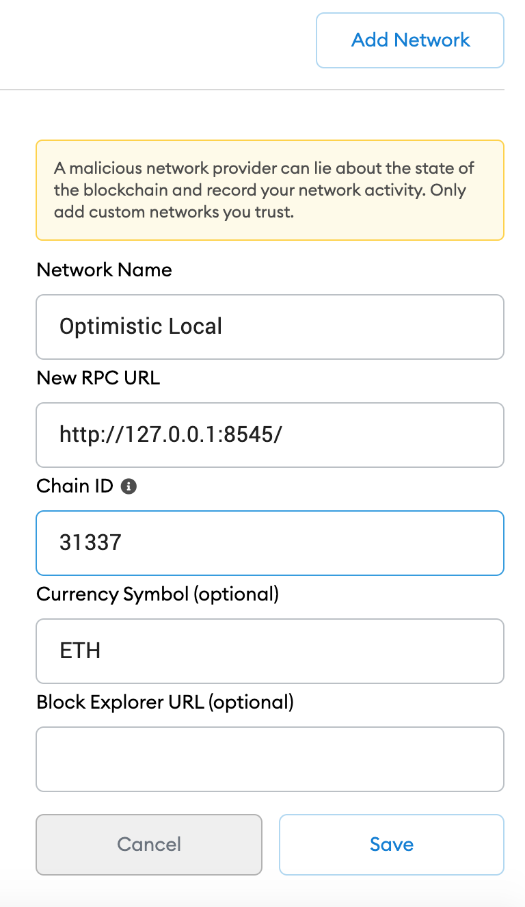
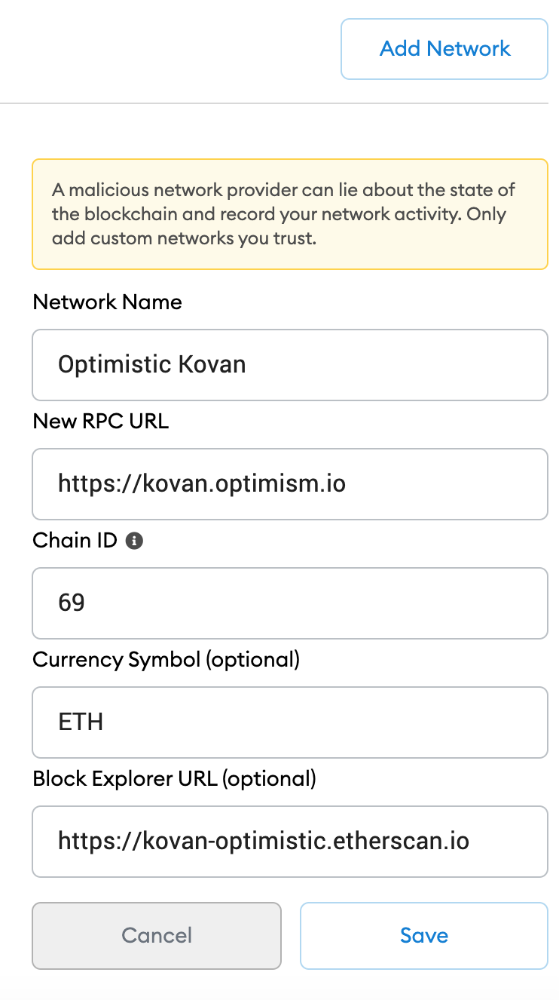
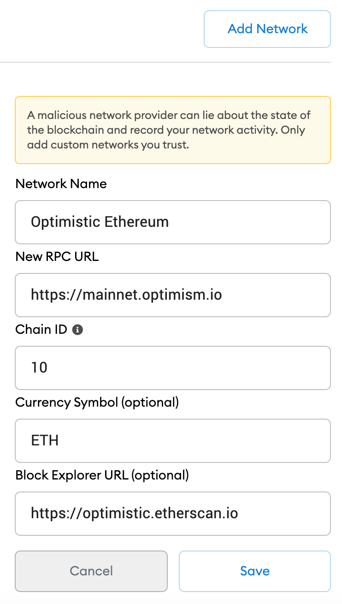

# NFT Collectibles Masterclass project deployed on Optimism network 

### About
Dapp University NFT Collectibles Masterclass project deployed to Optimism 
[Read accompanying document on Optimism & Optimistic Rollups](https://docs.google.com/document/d/1qJjz3rzGDKnVjs-qDdwDdGmDdtkLWmMjH4gUqrLP7Is/edit?usp=sharing)  
Stack used is  Truffle, Web3

This has simplified, changed contracts to make it easy to use on Optimism. In original masterclass NFT tokens
are bought with ETH a concept not valid on Optimism, so here we deploy an ERC20 on Optimism that is used to 
buy NFT's. Additionally ERC721.sol and Address.sol are stripped of some functions. 

### Technology Stack and Tools

* [Node Version Manager](https://heynode.com/tutorial/install-nodejs-locally-nvm) - node version manager
* [ERC721](https://docs.openzeppelin.com/contracts/3.x/erc721) - ERC721 Token standard (NFTs)
* [Optimism](https://optimism.io/) - Optimism Ethereum Scaling solution
* [Docker](https://www.docker.com/) - leading containerization solution
* [Metamask Wallet](https://metamask.io/) - Metamask Wallet
* [Yarn](https://yarnpkg.com/) - Alternative package manager to NPM 
* [Truffle](https://www.trufflesuite.com/) - development framework
* [React](https://reactjs.org/) - front end framework
* [Redux](https://redux.js.org/) - state management framework for React
* [Solidity](https://docs.soliditylang.org/en/v0.7.4/) - ethereum smart contract language
* [Ganache](https://www.trufflesuite.com/ganache) - local blockchain development
* [Web3](https://web3js.readthedocs.io/en/v1.3.0/) - library interact with ethereum nodes 
* [JavaScript](https://www.javascript.com/) - logic front end and testing smart contracts
* [Infura](https://infura.io/) - connection to ethereum networks 
* [Open Zeppelin](https://infura.io/) - smart contract libraries 
* [IPFS](https://ipfs.io/) - peer to peer hypermedia protocol
* [IPFS HTTP ](https://www.npmjs.com/package/ipfs-http-client) - JavaScript HTTP client library for IPFS implementations

##### Folder / Directory Structure (key folders)
* NFT Collectibles Masterclass
  * node_modules
  * public 
    * index.html
  * src
    * backEnd
        * abis
        * contracts
        * migrations
        * scripts
        * test
    * components
    * images
    * store
    * index.js
    * .env
    * .env.example
    * truffle.js
    * package.json

### Preconfiguration, Installation and Running project locally (Layer1 setups)

1. You will need nvm to install specific version node v14.16.0
```sh
$ curl -o- https://raw.githubusercontent.com/nvm-sh/nvm/v0.37.2/install.sh | bash
$ source ~/.nvm/nvm.sh
```
Restart your terminal

2. Install node v14.16.0
```sh
$ nvm install 14.16.0
$ nvm alias default 14.16.0
$ nvm use default
```

3. Install truffle globally
```sh
$ npm install -g truffle
```

4. If opting to use ganache-cli vs [Ganache GUI](https://www.trufflesuite.com/ganache), install ganache-cli globally. Note that ganache-cli rus on port 8545 and ganache-gui runs on port 7545 as placced in truffle-config.js. Check if ganache-cli installed first with
```sh
ganache-cli --version
```
If not installed install with below
```sh
$ npm install -g ganache-cli
$ ganache-cli
```
Run ganache-cli in different terminal and keep running when compiling,testing, migrating, running app etc
Copy and import privatekey first account into Metamask and ensure you have custom network localhost added
Important!!! Close/stop ganache or ganache-cli when running for Optimistic Networks.

5. Install and Run IPFS. Check if ipfs is not installed first with 
```sh
jsipfs version
```
If not installed install with below
   Install IPFS and run it:
```sh
$ npm i -g ipfs 
```

6.  Run IPFS Node in a different terminal and keep running:
If you have problems with ipfs connection during running app etc, restart the daemon 
```sh
$ jsipfs daemon
```

7. Install yarn if not installed. Check if installed using 
```sh
yarn --version
```
If not installed install with below
```sh
$ npm install --global yarn
```

8. Enter project directory and install dependancies
```sh
$ cd nft_collectibles_masterclass
$ yarn install  
```

### Migrating contracts and Testing on Ethereum Layer1 related networks Locally to ensure all is working well

1. To compile contracts e.g you make changes to contracts
```sh
$ truffle compile 
```

Make sure your truffle.js or truffle-config.js file is properly configured for development environment.
2. Migrate contracts to local running instance ganache 
If using ganache-cli use 
```sh
$ truffle migrate --reset --network ganache_cli
```
If using ganache gui use 
```sh
$ truffle migrate --reset --network ganache_gui
```

3. To test contracts 
```sh
$ truffle develop
$ test
```

4. Interact with locally deployed contracts and excute script to mint tokens. Esnure jsipfs daemon is running 
inand always running in a seperate terminal 

If using ganache-cli use
```sh
$ truffle exec src/backEnd/scripts/mint.js --network ganache_cli
$
```
If using ganache gui use
```sh
$ truffle exec src/backEnd/scripts/mint.js --network ganache_gui
$
```

5. Run app on localhost front-end
```sh
$ yarn start
```
Enter dApp in browser at localhost:3000 and interact with Metamask with imported priavate key on localhost network

### Deploying to Optimism network
[You can also lookup with Optimism Developer documentation here](https://community.optimism.io/docs/) or
reference with [Github repository](https://github.com/ethereum-optimism/optimism-tutorial)
@eth-optimism/solc is the package that will allow us to compile contracts for Optimism

3 Optimism networks to be discuseed here are: Local Optimism node, Optimistic Kovan(optimism-kovan) and Optimistic Ethereum(optimism-ethereum). Caution as testnet and mainnet networks are still in early stages at time of writing this document.

1. Setup networks in Metamask, see images below 

<span>


- Ensure you have a truffle-config-ovm.js file to compile contracts for Optimism.


## 1 => Deploy to Layer 2 local Optimism Node 

1. Run Local Optimistic Ethereum Node
Run and keep running a local Optimistic Ethereum node using Docker 
Make sure Docker Desktop is running eg on Mac or use service docker start 
You will require SSH setup for Github
git clone git@github.com:ethereum-optimism/optimism.git
cd optimism
yarn install
yarn build
cd ops
docker-compose build
docker-compose up
```
Run above in seperate terminal and Leave node running...
Ensure the mnemonicOptimism is left as is, in the truffle-config-ovm.js file 
Give it time to be fully up
First time you run all commands, afterwards  docker-compose up

1. Compile contracts
```sh
truffle compile --network optimistic_local --config truffle-config-ovm.js
```

2. Test on Local Optimistic Ethereum Node
```sh
truffle test --network optimistic_local --config truffle-config-ovm.js
```

3. Deploy Optimistic Ethereum Contract to local Optimism
```sh
truffle migrate --network optimistic_local --config truffle-config-ovm.js
```

4. Mint NFT's with script 
```sh
truffle exec src/backEnd/scripts/mint_ovm.js --network optimistic_local --config truffle-config-ovm.js
```

5. Run app on localhost front-end and interact with app
```sh
$ yarn run start
```

## 2 => Deploy to Layer 2 testnet Optimism Kovan 
Ensure you have Metamask installed and have saved 
your mnemonic phrase in .env file. Ensure you have an [infuraID](https://infura.io/) for an Optimistic Kovan Network
Ensure your Infura has Optimistic Networks add-ons enabled

1. Acquire Optimistic Kovan ETH 

- Get Kovan testnet ETH into a Metamask account e.g use faucets like [LinkFaucet Protofire](https://linkfaucet.protofire.io/kovan) or 

- Ensure Metamask is setup correctly for Optimistic Kovan Network see earlier section [or here](https://community.optimism.io/docs/developers/metamask.html#connecting-manually)

- Bridge [Kovan ETH to Optimistic Kovan ETH here](https://gateway.optimism.io/)

2. Deploy Contract to Optimistic Kovan
Gas price and Gas Limits vary so ensure you adjust accordingly in config file or migrations
```sh
truffle migrate --network optimistic_kovan --config truffle-config-ovm.js
```

3. Mint NFT's with script 
```sh
truffle exec src/backEnd/scripts/mint_ovm.js --network optimistic_kovan --config truffle-config-ovm.js
```

4. Run app on localhost front-end and interact with app
```sh
$ yarn run start
```

### Optional publish front end to Surge
1. Run build and enter build directory
```sh
$ yarn run build
$ cd build
```
2. Install surge globally: 
```sh
$ npm i -g surge
```
"You may need to Login to surge and create account with email address and a password first time.  
If you forgot password you can ask for reset on terminal and get password reset link in your email." 
Select a unique domain name for your project e.g <uniquename>.surge.sh e.g asdfjkl.surge.sh where
my name of choice is asdfjkl

3. Deploy to surge. 
```sh
$ surge --domain asdfjkl.surge.sh
```
...and follow the instructions


### Optional publish on IPFS

1. Build app
```sh
$ yarn run build
```
2. Publish on IPFS
```sh
$ jsipfs add -r build
```
3. Copy the latest generated hash and paste into the place of hash below:
https://ipfs.io/ipfs/hash For the first time may take a while to load dApp
Create Human readable link [Use this site](https://bitly.com/)

